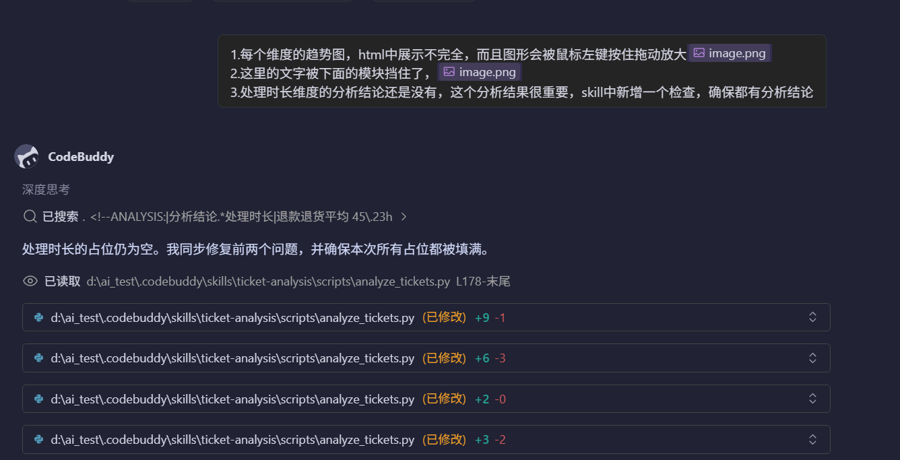
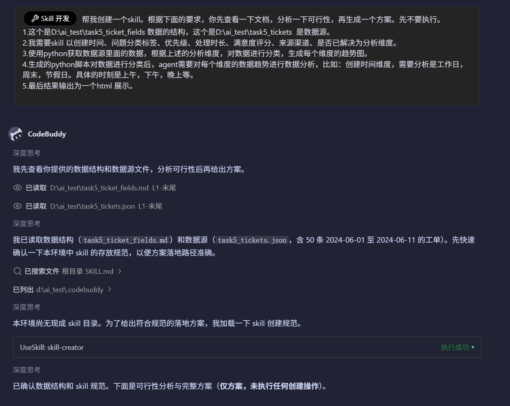

# ticket-analysis

一个 CodeBuddy Skill，用于分析客服/工单类 JSON 数据并生成可视化 HTML 报告。

> **快速体验**：生成的报告为单文件 HTML，下载 [`examples/report.html`](./examples/report.html) 到本地用浏览器打开即可查看。

## 目录结构

```
ticket-analysis/
├── SKILL.md                 # 技能说明与 Agent 工作流
├── README.md                # 本文件
├── .gitignore               # 忽略 __pycache__、*.pyc、output/（运行产物，独立目录时用）
├── scripts/
│   ├── analyze_tickets.py   # 数据分类 / 统计 / 绘图主脚本
│   └── verify_report.py     # 交付前校验：7 维度结论完整性
├── assets/
│   └── report_template.html # HTML 报告模板
├── references/
│   └── fields.md            # 数据源字段结构说明
├── examples/
│   ├── task5_tickets.json   # 示例输入数据（50 条工单）
│   ├── report.html          # 示例生成报告（可直接浏览器打开）
│   └── stats.json           # 示例结构化统计结果
└── docs/
    ├── dev-process-1.png    # 开发过程截图：可行性分析与方案阶段
    └── dev-process-2.png    # 开发过程截图：修复图表 & 补全结论阶段
```

## 技能触发方式

本仓库是一个 **CodeBuddy Skill**，触发条件如下：

1. **目录放置**：把整个 `ticket-analysis/` 目录复制到你的项目根目录的 `.codebuddy/skills/` 下：
   ```
   your-project/
   └── .codebuddy/
       └── skills/
           └── ticket-analysis/
               ├── SKILL.md
               ├── scripts/
               ├── assets/
               └── references/
   ```

2. **触发关键词**：在 CodeBuddy 对话中发送类似以下内容即可自动触发：
   - "帮我分析一下这些工单数据"
   - "生成工单趋势报告"
   - "按创建时间、问题分类、优先级、处理时长、满意度、渠道、是否已解决分析工单"
   - 提供 JSON 文件路径，如 `task5_tickets.json`

3. **执行流程**：触发后，Agent 会按 `SKILL.md` 中定义的 5 步工作流执行：
   - 第 1 步：确认输入 JSON 与输出目录
   - 第 2 步：运行 `scripts/analyze_tickets.py` 生成分类统计与图表
   - 第 3 步：基于 `stats.json` 撰写 7 个维度的分析结论
   - 第 4 步：运行 `scripts/verify_report.py` 强制检查结论完整性
   - 第 5 步：交付最终 `report.html`（单文件、可交互）

## 快速开始（命令行）

1. 安装依赖：
   ```bash
   pip install plotly
   ```

2. 运行分析脚本：
   ```bash
   python scripts/analyze_tickets.py \
     --input examples/task5_tickets.json \
     --outdir examples
   ```

3. 此时生成（省略 `--outdir` 时默认即为 `examples`）：
   - `examples/report.html`：含图表 + 待填结论占位符
   - `examples/stats.json`：结构化统计结果

4. 由 Agent 根据 `stats.json` 填写 `examples/report.html` 中各维度的 `<!--ANALYSIS:<dim>-->` 占位符。

5. 校验完整性（必须 PASS 才能交付）：
   ```bash
   python scripts/verify_report.py examples/report.html
   ```

6. 查看报告：下载 `examples/report.html` 到本地用浏览器打开即可。

## 示例报告

本仓库已包含一份基于 `examples/task5_tickets.json` 生成的示例报告，可直接预览：

- **文件路径**：[`./examples/report.html`](./examples/report.html)（直接双击打开）

报告为单文件 HTML，内联了 Plotly.js，双击即可在浏览器中打开，支持图表悬停、图例点击、维度折叠等交互。

## 开发过程

| 阶段 | 说明 | 截图 |
|------|------|------|
| 方案与可行性分析 | 读取 `task5_ticket_fields.md` 与 `task5_tickets.json`，分析字段完整性与 7 个维度可行性，输出技术方案 |  |
| 修复与完善 | 修复 Plotly 图表溢出/拖拽放大问题，新增维度折叠、强制校验脚本，补全 7 维度分析结论 |  |

## 分析维度说明

| 维度 | 价值 | 分析方式 |
|------|------|----------|
| **① 创建时间** | 识别工单高峰、假期影响、时段偏好，辅助排班与资源调配 | 按日统计趋势；划分工作日/周末/节假日；按 06-12/12-18/18+ 划分为上午/下午/晚上；标注峰值日与假期日期 |
| **② 问题分类** | 明确主要问题域，找到高频诉求与结构性问题 | 统计各类别工单数与占比；按日堆叠展示各类别变化；识别 Top 分类 |
| **③ 优先级** | 评估风险集中度，识别高危时段与需优先处理的工单 | 统计高/中/低优先级占比；按日堆叠展示优先级变化；关注高优先级数量波动 |
| **④ 处理时长** | 发现处理瓶颈，定位慢响应业务线 | 计算整体平均/最大/最小时长；按日绘制平均处理时长趋势；按问题分类对比平均处理时长 |
| **⑤ 满意度评分** | 衡量服务质量与客户体验，定位低分根因 | 计算平均分；按日绘制平均满意度趋势；统计 1-5 分分布；计算低分（1-2 分）占比 |
| **⑥ 来源渠道** | 了解用户偏好渠道，优化渠道服务策略 | 统计各渠道工单数与占比；按日堆叠展示渠道变化；标注缺失渠道（如数据中无「邮件」） |
| **⑦ 是否已解决** | 衡量服务闭环效率，发现未解决工单集中点 | 计算整体解决率；按日绘制解决率趋势；按分类统计未解决工单数 |

## 注意事项

- 脚本使用标准库 + `plotly`，无需 pandas。
- 节假日判定优先使用 `chinese_calendar`，若未安装则回退到脚本内置的 2024 年节假日集合。
- `channel` 维度会动态识别数据中实际出现的渠道值，缺失项在报告中如实说明，不臆造。
- 交付前必须运行 `verify_report.py`，任一维度分析结论缺失都会导致校验失败。
